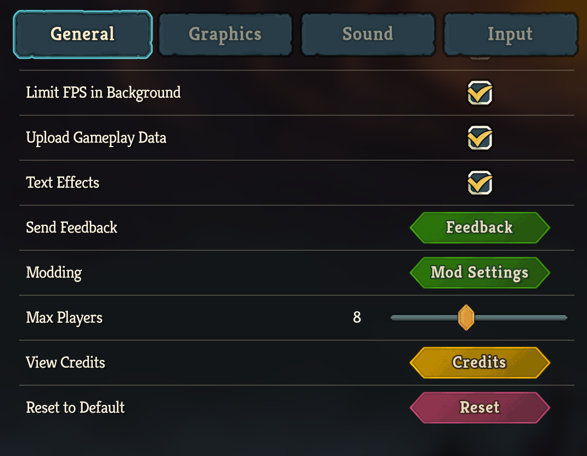

# STS 2 Unlimited

Play **Slay the Spire 2** multiplayer with any number of players. The vanilla game caps lobbies at 4; this mod removes that limit and lets you configure it from the in-game settings menu.



## Installation

1. Download `Sts2Unlimited.zip` from the [latest release](../../releases/latest)
2. Extract all files into your Slay the Spire 2 `mods/` folder:
   ```
   mods/
   └── Sts2Unlimited/
       ├── Sts2Unlimited.dll
       ├── 0Harmony.dll
       ├── Sts2Unlimited.pck
       ├── mod_manifest.json
       ├── icon.svg
       └── sts2unlimited.maxplayers.txt
   ```
3. Launch the game — the mod loads automatically

## Known Issues

| Platform | Symptom | Fix |
|---|---|---|
| Linux | Mod shows as enabled but errors on startup; lobbies hang on "loading" | [Force-load `libgcc_s`](#linux-force-load-libgcc_s) on the game binary |

### Linux: force-load `libgcc_s`

Harmony generates `/tmp/mm-exhelper.so` at runtime, which needs `_Unwind_RaiseException` from `libgcc_s.so.1`. Godot loads .NET with `RTLD_LOCAL`, so the symbol isn't in the global namespace when the helper is `dlopen`ed and it fails to load. Adding `libgcc_s.so.1` as a direct `NEEDED` entry on the main game binary forces it into the global namespace at startup:

```bash
sudo dnf install patchelf   # or apt/pacman equivalent
cd ~/.local/share/Steam/steamapps/common/Slay\ the\ Spire\ 2
cp SlayTheSpire2 SlayTheSpire2.bak
patchelf --add-needed libgcc_s.so.1 SlayTheSpire2
```

Steam game updates overwrite the binary, so re-apply after every update. See [#9](https://github.com/ajivoin/Sts2Unlimited/issues/9) for the full investigation (credit: @pxlnght).

## Configuration

The easiest way is the **in-game settings menu**: open Settings and use the "Max Players" slider (range: 2–256). Changes save automatically.

Alternatively, edit `sts2unlimited.maxplayers.txt` in the mods folder and restart the game. The default is **8 players**.

## How It Works

The game's networking layer already supports arbitrary player counts — the limit is enforced entirely by hardcoded `4` values at the lobby initialization sites. This mod uses [Harmony](https://github.com/pardeike/Harmony) to prefix-patch those methods and substitute the configured value:

| Patched Method | Purpose |
|---|---|
| `NetHostGameService.StartSteamHost()` | Steam lobby creation |
| `NetHostGameService.StartENetHost()` | ENet (direct IP) lobby creation |
| `NCharacterSelectScreen.InitializeMultiplayerAsHost()` | Standard run lobby |
| `NCustomRunScreen.InitializeMultiplayerAsHost()` | Custom run lobby |

Settings are persisted to `sts2unlimited.settings.json` via the game's own settings API, with fallback to the legacy text file.

## Limitations

- UI screens (character select, etc.) may feel crowded with many players
- Game balance is tuned for 4 players; behavior beyond that is untested
- Steam lobby size limits may apply regardless of this mod's setting

## Building from Source

Requires .NET 9 and the `sts2.dll` game reference assembly placed in the project root.

```bash
dotnet build --configuration ExportRelease
```

Output is bundled to `release/` by the `BundleRelease` MSBuild target.

### Project Structure

```
Sts2Unlimited.cs            — Harmony patches, config loading, entry point
SettingsMenuIntegration.cs  — Injects slider into the game's settings screen
sts2unlimited.csproj        — Build config and BundleRelease target
mod_manifest.json           — Mod metadata (name, version, author)
export_presets.cfg          — Godot resource export config
```

## License

[MIT](LICENSE.md)
